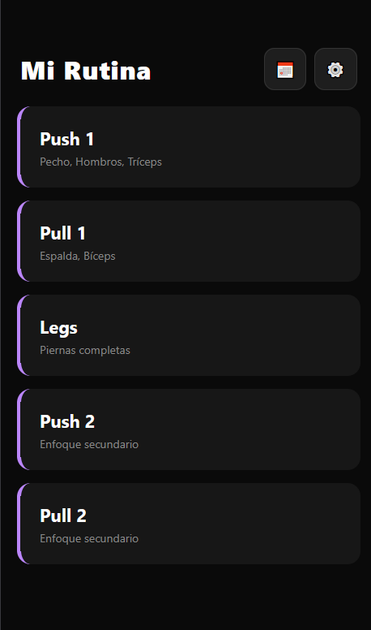
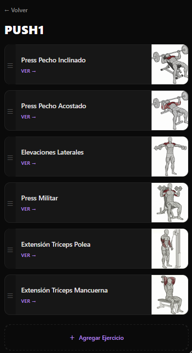
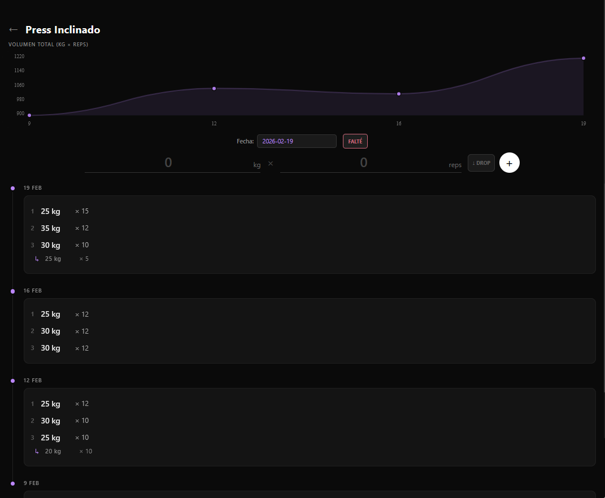
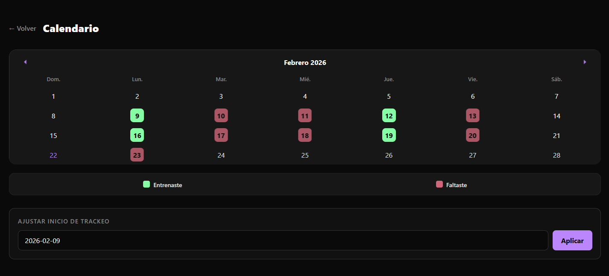
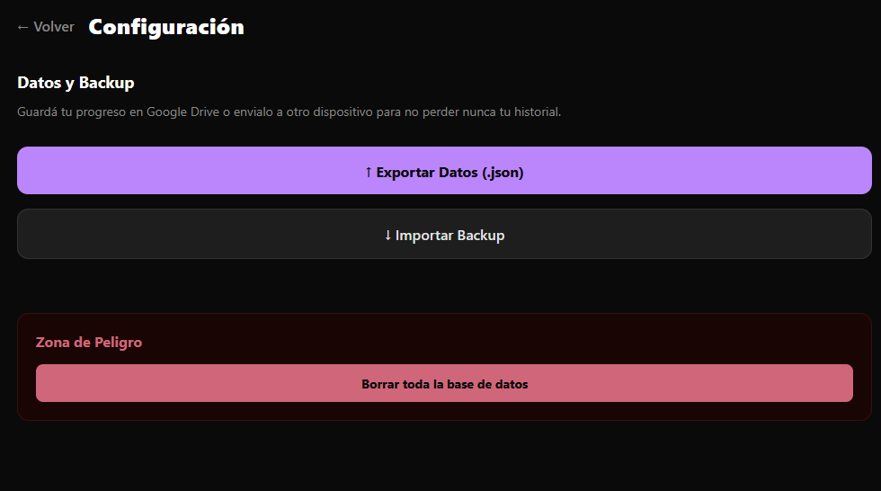

# 🏋️‍♂️ Mi Rutina - Gym Tracker App

Una aplicación móvil minimalista y offline-first desarrollada en **React Native (Expo)** para registrar, analizar y optimizar rutinas de entrenamiento en el gimnasio. Diseñada enfocándose en la experiencia de usuario, la velocidad y la soberanía de los datos.

## 🚀 Características Principales

* **📱 Offline-First & Privacidad:** Los datos se guardan exclusivamente en el dispositivo del usuario mediante `AsyncStorage`. Sin tiempos de carga, sin necesidad de conexión a internet en el gimnasio y sin recolección de datos en la nube.
* **📊 Análisis de Progresión Real:** Gráficos interactivos que calculan automáticamente el **Volumen Total (Tonelaje)** de cada sesión (Kilos × Repeticiones) para visualizar la sobrecarga progresiva a lo largo del tiempo.
* **🧩 Arquitectura Modular (Drag & Drop):** Catálogo inteligente de ejercicios dividido por grupos musculares. Los usuarios pueden agregar, quitar y reordenar (`react-native-draggable-flatlist`) los ejercicios de su rutina diaria con total libertad.
* **🩸 Soporte para Drop Sets:** Lógica especializada para registrar series descendentes (Drop Sets) vinculándolas visual y matemáticamente a la serie principal sin romper la estructura de datos.
* **📅 Calendario de Consistencia:** Tracking automático de asistencia que escanea el historial de la base de datos y pinta un mapa de calor mensual destacando los días entrenados y los días de descanso/falta.
* **💾 Sistema de Backup (JSON):** Herramienta nativa para exportar e importar la base de datos completa en formato `.json` al sistema de archivos del celular, permitiendo migraciones seguras y respaldos en Google Drive.

## 🛠️ Tecnologías Utilizadas

* **Framework:** React Native + Expo (EAS Build)
* **Lenguaje:** TypeScript / JavaScript
* **Almacenamiento Local:** `@react-native-async-storage/async-storage`
* **Navegación:** Expo Router (File-based routing)
* **Gráficos:** `react-native-chart-kit`
* **Gestos y Animaciones:** `react-native-reanimated` & `react-native-gesture-handler`
* **Sistema de Archivos:** `expo-file-system`, `expo-sharing`, `expo-document-picker`

## 📸 Capturas de Pantalla
| Menú Principal | Ejercicios | Gráfico de Progreso | Calendario | Config |
| :---: | :---: | :---: | :---: |:---: |
|  |  |  |  |  |

## ⚙️ Instalación y Uso Local

Si querés clonar este proyecto y correrlo en tu máquina local:

1. Cloná el repositorio:
   ```bash
   git clone [https://github.com/TU_USUARIO/mi-rutina-app.git](https://github.com/TU_USUARIO/mi-rutina-app.git)
   ```
2. Instalá las dependencias:
   ```bash
   cd mi-rutina-app
   npm install
   ```
3. Iniciá el servidor de desarrollo de Expo:
   ```bash
   npx expo start -c
   ```
4. Escaneá el código QR con la app **Expo Go** (Android/iOS) o presioná `a` para abrirlo en un emulador de Android.
## 📦 Compilación (APK)

El proyecto está configurado para compilarse a través de **Expo Application Services (EAS)**. Para generar un archivo `.apk` instalable en dispositivos Android físicos:
```bash
   npm install -g eas-cli
   eas login
   eas build -p android --profile preview
```
---

*Desarrollado con ☕ y código limpio por [Diego/Diegoklp1].*